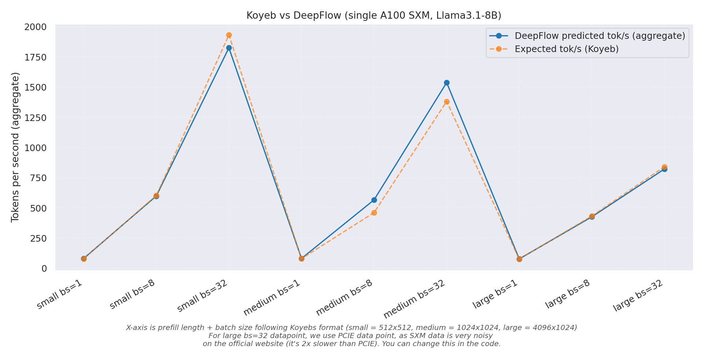

# RAPID-LLM

RAPID-LLM is a Python modeling tool for hardware- and network-aware LLM training/inference performance, memory, and (rudimentary) energy modeling. It builds compute/communication graphs and runs either analytically or via AstraSim. It also supports running standalone GEMM operations.

## Installation Guide

Prerequisite: Python 3

### Step 1. Clone the repository

```bash
git clone https://github.com/nanocad-lab/Rapid-LLM.git
cd Rapid-LLM
```

### Step 2. Set up the environment

#### Option A: Using uv (recommended)

- `pip install uv`
- `uv venv [/path/to/new/virtual/environment]`
- `source [/path/to/new/virtual/environment]/bin/activate`
- `uv sync`

If you want the example scripts to run through uv, set `RAPID_UV_RUN=1` before invoking them. Otherwise they default to `python`.

#### Option B: Using pip

- `python3 -m venv [/path/to/new/virtual/environment]`
- `source [/path/to/new/virtual/environment]/bin/activate`
- `pip install --upgrade pip`
- `pip install -r requirements.txt`

### Step 3. (Optional) Set up AstraSim for advanced network simulation

- `git submodule update --init --recursive`
- `git submodule update --remote -- astra-sim`
- `ASTRA_SIM=$(realpath ./astra-sim)`
- `cd ${ASTRA_SIM}`
- `git submodule update --remote -- extern/network_backend/analytical`
- `./build/astra_analytical/build.sh`
- `cd ..`

### Troubleshooting

If you encounter protobuf failures while building AstraSim, try:

- `pip uninstall protobuf`
- `pip install protobuf==3.20.3`

### Step 4. Verify the installation (LLM)

Examples use `python` by default. To route them through uv, run them with `RAPID_UV_RUN=1`.

- `./examples/llm.sh` (analytical backend, training on Llama2-7B)
- `./examples/llm_inference.sh` (analytical backend, inference on Llama2-7B)
- `./examples/llm_astra.sh` (AstraSim backend, training on Llama2-7B)
- `./examples/llm_astra_inference.sh` (AstraSim backend, inference on Llama2-7B)

Example with uv:

```bash
RAPID_UV_RUN=1 ./examples/llm.sh
```

## Quick Start (LLM)

Training:

```bash
python run_perf.py \
  --hardware_config configs/hardware-config/a100_80GB.yaml \
  --model_config configs/model-config/LLM.yaml
```

Inference (prefill + decode):

```bash
python run_perf.py \
  --hardware_config configs/hardware-config/a100_80GB.yaml \
  --model_config configs/model-config/LLM_inf.yaml
```

Results are written under `output/`.

## GEMM

GEMM mode is a focused, lightweight distributed GEMM checker. It is not a full model simulation, but is useful for validating GEMM sharding assumptions.

- Configure GEMM dimensions and `gemm_shard_axis` in `configs/model-config/GEMM.yaml`.
- Configure `parallelism.tp` in the hardware config.
- Run:

```bash
python run_perf.py \
  --hardware_config configs/hardware-config/a100_80GB.yaml \
  --model_config configs/model-config/GEMM.yaml
```

## Execution Backend Configuration

RAPID-LLM supports four execution backends with different accuracy and performance characteristics. Configure the backend in your hardware config file under `execution_backend`.

### 1. Analytical RAPID-LLM (Default - no AstraSim needed)

- **Accuracy:** Very fast but inaccurate; ring-only network model and no congestion modeling.
- **Configuration:**

```yaml
execution_backend:
  model: analytical
```

### 2. Hybrid (AstraSim needed)

- **Accuracy:** More accurate; models congestion in transformer blocks only but roughly 2-3x slower.
- **Execution:** RAPID-LLM executes the pipeline graph; AstraSim executes the transformer block graph.
- **Configuration:**

```yaml
execution_backend:
  model: astra
  astra:
    mode: hybrid
```

### 3. Full AstraSim Hierarchical (AstraSim needed)

- **Accuracy:** More accurate; models congestion in transformer and pipeline graphs separately. Assumes no congestion between pipeline/data parallelism and tensor parallelism (optimistic). Roughly as fast as Hybrid for small systems, increasingly slower for larger systems.
- **Execution:** AstraSim executes both pipeline and transformer block graphs separately.
- **Configuration:**

```yaml
execution_backend:
  model: astra
  astra:
    mode: full_astrasim_hierarchical
```

### 4. Full AstraSim Flattened (AstraSim needed)

- **Accuracy:** Most accurate; models congestion between all collectives with no separate network assumptions. Very slow for large systems but most comprehensive.
- **Execution:** AstraSim executes one big flattened graph combining pipeline and transformer operations.
- **Configuration:**

```yaml
execution_backend:
  model: astra
  astra:
    mode: full_astrasim_flattened
```

## AstraSim Artifact and Graph Visualization

RAPID-LLM can generate and visualize graphs, and when using the AstraSim network backend, can also generate and visualize network communication artifacts.

### Environment Flags

- `RAPID_VISUALIZE_GRAPHS=1`: Generate graph visualizations of RAPID-LLM computation graphs (no AstraSim artifact visualization).
- `RAPID_PERSIST_ASTRASIM_ARTIFACTS=1`: Enable artifact persistence to disk (for both AstraSim and RAPID-LLM artifacts).
- `RAPID_PERSIST_ARTIFACT_VIZ=1`: Generate PNG visualizations and text dumps for persisted AstraSim ET files (very slow for many nodes).
- Do not set `RAPID_PERSIST_ARTIFACT_VIZ=1` for multi-threaded runs.

### Artifact Output Locations

- Flattened execution mode: `output/LLM/astra_flat/`
- Hierarchical/Hybrid modes: `output/LLM/astra_hier/`

### Generated Files

- `.et` files: Chakra execution traces for AstraSim replay.
- `.png` files: Rendered PNG visualizations (when `RAPID_VISUALIZE_GRAPHS=1` or `RAPID_PERSIST_ARTIFACT_VIZ=1`).
- `.txt` files: Human-readable text dumps of ET files (when `RAPID_PERSIST_ARTIFACT_VIZ=1`).

### Debugging: Usage Example

```bash
RAPID_PERSIST_ASTRASIM_ARTIFACTS=1 RAPID_VISUALIZE_GRAPHS=1 RAPID_PERSIST_ARTIFACT_VIZ=1 python run_perf.py \
  --hardware_config configs/hardware-config/a100_80GB.yaml \
  --model_config configs/model-config/LLM.yaml
```

## Example Case Study: Tensor Parallelism on Inference Runtime

This is a short step-by-step guide on how to use RAPID-LLM to estimate the inference runtime of a LLM model with varying degrees of tensor parallelism on the default A100 80GB hardware config.

1. Start by creating a model config yaml file. You can do so manually, but for this example we will use the helper configs/model-config/hf_to_config.py script to generate the config file from a HuggingFace model (in this case, Qwen/Qwen2.5-3B).

```bash
python configs/model-config/hf_to_config.py Qwen/Qwen2.5-3B --run-type inference --batch-size 32 --seq-len 65536 --decode-len 1024 --use-flashattention true --flash-tile-size 256 -o configs/model-config/Qwen2.5-3B.yaml
```

The config file for Qwen2.5-3B is generated under `configs/model-config`.

2. Open the provided A100 hardware file and set tensor parallel degree to 1:

Edit `configs/hardware-config/a100_80GB.yaml` so that `parallelism.tp: 1`. This models one GPU without tensor parallelism.

Run the inference estimation using the example configs:

```bash
python run_perf.py --hardware_config configs/hardware-config/a100_80GB.yaml --model_config configs/model-config/Qwen2.5-3B.yaml
```

3. To see the effects of tensor-parallelism, modify the hardware file, switching to two devices per node, and tp = 2.

Edit `configs/hardware-config/a100_80GB.yaml` so that `parallelism.tp: 2`. This models two GPU inference with tensor parallelism degree of 2.

Re-run the same inference command with the updated hardware config.

Comparing the two runs will show how increasing tensor parallelism changes the predicted inference runtime for this model (in this case, by around 50%).

## Current Support and Feature Status (LLM)

### AstraSim Integration
- **Supported:** AstraSim integration is supported for all LLM execution modes.
- **Work in progress:** AstraSim integration is not fully validated, and only supports 1D network topologies.

### FlashAttention
- **Current support:**
  - Forward pass for training
  - Prefill phase in inference
- **Work in progress:**
  - Attention tile size is currently manually defined.
  - Inference decode does not use FlashAttention (decode is memory-bound; FlashDecoding-style kernels are not implemented).

### Data Parallelism
- **Supported:** training and inference.
- For inference, DP acts as a replica multiplier; replicas do not communicate.

### Tensor Parallelism
- **Supported:** training and inference.
- Implements Megatron-LM style tensor parallelism, with optional sequence parallelism.

### Pipeline Parallelism
- **Supported:** training and inference.
- GPipe-style pipeline scheduling only.

### Context Parallelism
- **Supported:** training only.
- Inference CP is WIP.

### Hybrid Parallelism
- **Supported:** Hybrid parallelism is supported for all LLM training/inference configurations with limitations listed for each parallelism type above.

### Attention Types
- **Supported:** MHA and GQA (MQA = GQA with `num_kv_heads=1`).
- **Work in progress:** MLA and sliding-window attention.

### Mixture of Experts (MoE)
- **Supported:** Single-GPU case in both training and inference (WIP).
- **Work in progress:** Multi-GPU expert parallelism and validation.

### Memory Estimation
- **Status:** Enabled.
- **Supported:** Per-GPU peak from flattened graphs for training and inference. Training uses persistent vs transient activations (full/selective recompute supported). Inference uses `max(prefill peak, final decode peak)` and includes KV-cache bytes. 
- **Not modeled:** Embedding/softmax activations or weights, comm buffers, allocator effects/fragmentation, MoE memory beyond single-GPU, or CP inference.

### KV-Cache
- **Supported:** KV-cache runtime impact and memory estimation (graph-based peak uses per-layer KV cache bytes).

### Energy Estimation
- **Supported:** WIP Rudimentary inference-only model. Not yet validated.
- **Work in progress:** Training support and refinement.

### Mixed Precision
- **Supported:** Mixed precision is supported for all supported parallelism and model types.
- **Work in progress:** KV cache precision cannot yet be set (config value is ignored).

### Validation
- **Status:** Validation scripts are available in validation_scripts folder. We also validate against Megatron-LM and other paper data for inference and training, including networking, for up to 3000 GPUs. Below is a validation plot against Koyeb's single NVIDIA A100 data on Llama3.1-8B. The relevant script can be found in `validation_scripts/koyeb.py`. A memory-estimator smoke test lives at `validation_scripts/memory_estimator_smoke.py`.


