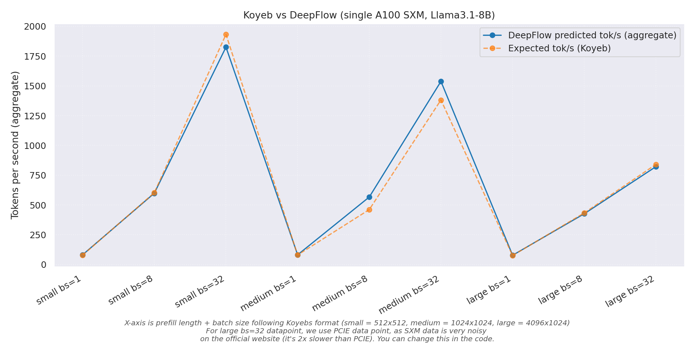

# RAPID-LLM

RAPID-LLM is a Python modeling tool for hardware- and network-aware LLM training/inference performance, memory, and (rudimentary) energy modeling. It builds compute/communication graphs and runs either analytically or via AstraSim. It also supports running standalone GEMM operations.

## Installation Guide

Prerequisite: Python 3

### Step 1. Clone the repository

```bash
git clone https://github.com/nanocad-lab/Rapid-LLM.git
cd Rapid-LLM
```

### Step 2. Set up the environment

#### Option A: Using uv (recommended)

- `pip install uv`
- `uv venv [/path/to/new/virtual/environment]`
- `source [/path/to/new/virtual/environment]/bin/activate`
- `uv sync`

If you want the example scripts to run through uv, set `RAPID_UV_RUN=1` before invoking them. Otherwise they default to `python`.

### Launch Web UI

After `uv sync`, run from the repository root:

```bash
./launch_webui.sh
```

Open `http://127.0.0.1:8050` in a browser. The launcher runs `uv run --frozen --no-sync python -m webui.app.main`; override the bind address with `RAPID_WEBUI_HOST` or `RAPID_WEBUI_PORT` if needed.

#### Option B: Using pip

- `python3 -m venv [/path/to/new/virtual/environment]`
- `source [/path/to/new/virtual/environment]/bin/activate`
- `pip install --upgrade pip`
- `pip install -r requirements.txt`

### Step 3. (Optional) Set up AstraSim for advanced network simulation

- `git submodule update --init --recursive`
- `git submodule update --remote -- astra-sim`
- `ASTRA_SIM=$(realpath ./astra-sim)`
- `cd ${ASTRA_SIM}`
- `git submodule update --remote -- extern/network_backend/analytical`
- `./build/astra_analytical/build.sh`
- `cd ..`

### Troubleshooting

If you encounter protobuf failures while building AstraSim, try:

- `pip uninstall protobuf`
- `pip install protobuf==3.20.3`

### Step 4. Verify the installation (LLM)

Examples use `python` by default. To route them through uv, run them with `RAPID_UV_RUN=1`.

- `./examples/llm.sh` (analytical backend, training on Llama2-7B)
- `./examples/llm_inference.sh` (analytical backend, inference on Llama2-7B)
- `./examples/llm_astra.sh` (AstraSim backend, training on Llama2-7B)
- `./examples/llm_astra_inference.sh` (AstraSim backend, inference on Llama2-7B)

Example with uv:

```bash
RAPID_UV_RUN=1 ./examples/llm.sh
```

## Quick Start (LLM)

Training:

```bash
python run_perf.py \
  --hardware_config configs/hardware-config/a100_80GB.yaml \
  --model_config configs/model-config/LLM.yaml
```

Inference (prefill + decode):

```bash
python run_perf.py \
  --hardware_config configs/hardware-config/a100_80GB.yaml \
  --model_config configs/model-config/LLM_inf.yaml
```

Results are written under `output/`.

## GEMM

GEMM mode is a focused, lightweight distributed GEMM checker. It is not a full model simulation, but is useful for validating GEMM sharding assumptions.

- Configure GEMM dimensions and `gemm_shard_axis` in `configs/model-config/GEMM.yaml`.
- Configure `parallelism.tp` in the hardware config.
- Run:

```bash
python run_perf.py \
  --hardware_config configs/hardware-config/a100_80GB.yaml \
  --model_config configs/model-config/GEMM.yaml
```

## Execution Backend Configuration

RAPID-LLM supports four execution backends with different accuracy and performance characteristics. Configure the backend in your hardware config file under `execution_backend`.

### 1. Analytical RAPID-LLM (Default - no AstraSim needed)

- **Accuracy:** Very fast but inaccurate; ring-only network model and no congestion modeling.
- **Configuration:**

```yaml
execution_backend:
  model: analytical
```

### 2. Hybrid (AstraSim needed)

- **Accuracy:** More accurate; models congestion in transformer blocks only but roughly 2-3x slower.
- **Execution:** RAPID-LLM executes the pipeline graph; AstraSim executes the transformer block graph.
- **Configuration:**

```yaml
execution_backend:
  model: astra
  astra:
    mode: hybrid
```

### 3. Full AstraSim Hierarchical (AstraSim needed)

- **Accuracy:** More accurate; models congestion in transformer and pipeline graphs separately. Assumes no congestion between pipeline/data parallelism and tensor parallelism (optimistic). Roughly as fast as Hybrid for small systems, increasingly slower for larger systems.
- **Execution:** AstraSim executes both pipeline and transformer block graphs separately.
- **Configuration:**

```yaml
execution_backend:
  model: astra
  astra:
    mode: full_astrasim_hierarchical
```

### 4. Full AstraSim Flattened (AstraSim needed)

- **Accuracy:** Most accurate; models congestion between all collectives with no separate network assumptions. Very slow for large systems but most comprehensive.
- **Execution:** AstraSim executes one big flattened graph combining pipeline and transformer operations.
- **Configuration:**

```yaml
execution_backend:
  model: astra
  astra:
    mode: full_astrasim_flattened
```

## AstraSim Artifact and Graph Visualization

RAPID-LLM can generate and visualize graphs, and when using the AstraSim network backend, can also generate and visualize network communication artifacts.

### Environment Flags

- `RAPID_VISUALIZE_GRAPHS=1`: Generate graph visualizations of RAPID-LLM computation graphs (no AstraSim artifact visualization).
- `RAPID_PERSIST_ASTRASIM_ARTIFACTS=1`: Enable artifact persistence to disk (for both AstraSim and RAPID-LLM artifacts).
- `RAPID_PERSIST_ARTIFACT_VIZ=1`: Generate PNG visualizations and text dumps for persisted AstraSim ET files (very slow for many nodes).
- Do not set `RAPID_PERSIST_ARTIFACT_VIZ=1` for multi-threaded runs.

### Artifact Output Locations

- Flattened execution mode: `output/LLM/astra_flat/`
- Hierarchical/Hybrid modes: `output/LLM/astra_hier/`

### Generated Files

- `.et` files: Chakra execution traces for AstraSim replay.
- `.png` files: Rendered PNG visualizations (when `RAPID_VISUALIZE_GRAPHS=1` or `RAPID_PERSIST_ARTIFACT_VIZ=1`).
- `.txt` files: Human-readable text dumps of ET files (when `RAPID_PERSIST_ARTIFACT_VIZ=1`).

### Debugging: Usage Example

```bash
RAPID_PERSIST_ASTRASIM_ARTIFACTS=1 RAPID_VISUALIZE_GRAPHS=1 RAPID_PERSIST_ARTIFACT_VIZ=1 python run_perf.py \
  --hardware_config configs/hardware-config/a100_80GB.yaml \
  --model_config configs/model-config/LLM.yaml
```

## Example Case Study: Tensor Parallelism on Inference Runtime

This is a short step-by-step guide on how to use RAPID-LLM to estimate the inference runtime of a LLM model with varying degrees of tensor parallelism on the default A100 80GB hardware config.

1. Start by creating a model config yaml file. You can do so manually, but for this example we will use the helper configs/model-config/hf_to_config.py script to generate the config file from a HuggingFace model (in this case, Qwen/Qwen2.5-3B).

```bash
python configs/model-config/hf_to_config.py Qwen/Qwen2.5-3B --run-type inference --batch-size 32 --seq-len 65536 --decode-len 1024 --use-flashattention true --flash-tile-size 256 -o configs/model-config/Qwen2.5-3B.yaml
```

The config file for Qwen2.5-3B is generated under `configs/model-config`.

2. Open the provided A100 hardware file and set tensor parallel degree to 1:

Edit `configs/hardware-config/a100_80GB.yaml` so that `parallelism.tp: 1`. This models one GPU without tensor parallelism.

Run the inference estimation using the example configs:

```bash
python run_perf.py --hardware_config configs/hardware-config/a100_80GB.yaml --model_config configs/model-config/Qwen2.5-3B.yaml
```

3. To see the effects of tensor-parallelism, modify the hardware file, switching to two devices per node, and tp = 2.

Edit `configs/hardware-config/a100_80GB.yaml` so that `parallelism.tp: 2`. This models two GPU inference with tensor parallelism degree of 2.

Re-run the same inference command with the updated hardware config.

Comparing the two runs will show how increasing tensor parallelism changes the predicted inference runtime for this model (in this case, by around 50%).

## Idle-time accounting

RAPID-LLM records kernel-level (roofline-stall) idle time during GEMM pricing: for
every priced GEMM, `idle = max(0, observed_compute_time - flops / peak_throughput)`,
where `flops` are the per-rank *sharded* flops that produced the observed per-rank
compute time and `peak_throughput` is the instance's own peak FLOP/s (`self.th`).
This measures the portion of a kernel's modeled wall time not explained by
peak-FLOP execution (memory-bound phases, launch overhead, tiling inefficiency).

Idle samples land in one of two buckets:

- **layer** — operations repeated once per transformer layer (attention/MLP GEMMs,
  flash-attention GEMM components, MLA composite GEMMs). Because GEMMs are priced
  once per unique layer graph, this bucket holds the idle seconds of ONE layer.
- **global** — operations executed once per step/batch (the vocab-projection
  `linear_softmax` GEMM).

The thermal idle fraction scales the layer bucket by the layer count:

```
GPU_time_frac_idle_thermal = (layer_idle * num_layers + global_idle) / total_time
```

Output lines (parsed by the thermal_stco consumer; formats are load-bearing):

- `LLM_training_results.txt`: `GPU_time_frac_idle: {:.8f}`,
  `GPU_time_frac_idle_thermal: {:.8f}`, `Idle Time Layer: {:.8f}s`,
  `Idle Time Global: {:.8f}s` (plus the pre-existing `Total Time: {:.8f}`).
- `LLM_inference_results.txt`: `GPU_time_frac_idle`, `GPU_time_frac_idle_thermal`,
  `Prefill Time` / `Decode Time` (at `.8f` + `s`), and
  `Prefill/Decode Idle [Layer|Global] Time: {:.8f}s`. For inference the thermal
  formula is `((prefill_idle_layer + decode_idle_layer) * num_layers +
  prefill_idle_global + decode_idle_global) / total_time`. Prefill idle is
  snapshotted immediately after the prefill run (before the decode-shaped
  memory-estimation graphs are priced); decode idle comes from per-sample fresh
  timing instances and is trapezoid-integrated exactly like decode time/energy.
  No `Total Inference Time:` line is ever emitted (it would silently take over
  the consumer's last-match runtime pick).

Known limitations (v1):

- Embedding and pointwise ops (layernorm, softmax, residual, gelu/swiglu) are not
  instrumented; being memory-bound, this under-reports idle.
- Communication/collective time and pipeline bubbles are never counted as idle
  (the observation covers compute time only; grad-accumulation time is excluded).
- Timing results are unchanged by the instrumentation: recording is a pure
  observation on the pricing path.

## Per-device throttle profiles (heterogeneous devices)

`full_astrasim_flattened` runs can model per-device hardware throttling (e.g. a
thermally hot device in a waferscale grid). Add a top-level `device_profiles:`
block to the hardware YAML (the primary surface), or pass
`--device_profiles <yaml>` to `run_perf.py` to REPLACE that block for one run:

```yaml
device_profiles:
  profiles:
    hot:
      frequency_scale: 0.80          # x tech_param.core.operating_frequency
      hbm_bandwidth_scale: 0.90      # x tech_param.DRAM.bandwidth
      hbm_latency_scale: 1.00        # x tech_param.DRAM.latency
      l2_bandwidth_scale: 1.00       # x tech_param.SRAM-L2.bandwidth
      l1_bandwidth_scale: 1.00       # x tech_param.SRAM-L1.bandwidth
      register_bandwidth_scale: 1.00 # x tech_param.SRAM-R.bandwidth
    nominal: {}                      # all scales default to 1.0
  devices:                           # keyed by flattened hw_id (dp=0 slice id)
    0: hot
    default: nominal
  dp_devices:                        # OPTIONAL, training with dp>1 only
    "0,1": hot                       # device hw_id=0 in dp replica 1
```

Sample files live under `configs/device-profiles/`; a full hardware config with
an embedded block is `configs/hardware-config/a100_80GB_flat_pp2_device_profiles.yaml`.

Semantics and constraints:

- Per-op durations are **re-priced through the full roofline/tiling model**
  under each profile's parameters, per pricing path (training, prefill, and
  each sampled decode step separately) — no flat duration multipliers. Each
  profile re-runs tile/kernel selection at its operating point (the model's
  best kernel there); real DVFS does not re-tile mid-run, but this keeps a
  uniform profile exactly equivalent to a globally scaled hardware config.
- Stage-level embedding/`linear_softmax` node durations embed analytic comm
  time; only their compute component shifts (additive delta). Optimizer nodes
  are re-priced through the HBM-bandwidth-bound `apply_grad` path.
- Requires `execution_backend.astra.mode: full_astrasim_flattened`; analytical,
  hybrid, and hierarchical modes hard-error (they cannot represent per-device
  compute). GEMM/ViT/MoE and `optimize_2dmap` are rejected. `dp_devices`
  requires training with `dp > 1`. Network/link throttling is out of scope
  (use `network.faulty_links`).
- Profile resolution order: `dp_devices["hw,dp"]` -> `devices[hw]` ->
  `devices.default`; every flattened device must resolve, and every explicit
  key must exist in the flattened graph (hard errors otherwise).

Every flattened-mode run (with or without profiles) also writes
`output/<MODE>/device_metrics.json` (`schema_version: 1`) with per-device
`rank`/`hw_id`/`dp_idx`/axis coordinates, profile name, `compute_busy_s`,
`wall_time_s`, `sched_idle_frac = clamp(1 - busy/makespan, 0, 1)`,
`layers_hosted`, `hosts_lm_head`, and kernel-idle fields from the device's
profile-instance counters. `makespan_s` is the raw AstraSim total
(pre `pipeline_interleave_scale`, which is recorded alongside), GA-combined for
training (with a per-run `runs` sub-array) and prefill + trapezoid-integrated
decode for inference. Comm/SEND/RECV time lands in the `sched_idle_frac`
complement (it is not separable from the ET) — thermal consumers must not treat
it as pure idle-power time. When profiles are active the `GPU_time_frac_idle*`
lines in the results txt keep baseline (pricing-time) semantics;
**profile-aware consumers must read `device_metrics.json`**, and cache-carrying
consumers should extend their file fingerprints with `device_profiles.py`,
`llm_execution.py`, and `astrasim_lib/`.

To run without a built astra-sim submodule, point `RAPID_ASTRASIM_BINARY` at an
external `AstraSim_Analytical_Congestion_Aware` binary (Chakra protobufs from
the same tree go on `PYTHONPATH`).

## Current Support and Feature Status (LLM)

### AstraSim Integration
- **Supported:** AstraSim integration is supported for all LLM execution modes.

### Network Topologies
- **Supported:** 1D and 2D topologies (+SuperPOD-style Fat Tree) in AstraSim configs.

### Faulty Links
- **Supported:** Faulty links are supported in AstraSim runs. We support soft (bandwidth derate, all cases) and hard (link failure, dense 2D topologies only) link failures. Hierarchical/flattened mode only.

### FlashAttention
- **Current support:**
  - Training and inference(prefill only).
- **Work in progress:**
  - Attention tile size is manually specified when FlashAttention is enabled.
  - Inference decode is memory bound and does not typically benefit from FlashAttention. Hence it is disabled. FlashDecoding kernels are not implemented.

### Data Parallelism
- **Supported:** training and inference.
- For inference, `replica_count` scales throughput only and replicas do not communicate.

### Tensor Parallelism
- **Supported:** training and inference.
- Implements Megatron-LM style tensor parallelism, with optional sequence parallelism.

### Pipeline Parallelism
- **Supported:** training and inference.
- GPipe-style pipeline scheduling only.

### Context Parallelism
- **Supported:** Training. No MoE support.
- Inference CP is not supported yet.

### Hybrid Parallelism
- **Supported:** Hybrid parallelism is supported for all LLM training/inference configurations with limitations listed for each parallelism type above.

### Attention Types
- **Supported:** MHA and GQA (MQA = GQA with `num_kv_heads=1`).
- **Work in progress:** MLA and sliding-window attention.

### Mixture of Experts (MoE)
- **Training support:**
  - Single GPU and multi GPU expert parallelism
  - TP with EP requires sequence parallelism
- **Inference support:**
  - TP GPUs are also used for expert parallelism
  - `moe_dp` expands the expert pool. The routing group size is `tp * moe_dp`.
- **Work in progress:**
  - Validation coverage for large multi GPU MoE runs
  - MoE with ZeRO-2/3 is not supported
  - MoE with faulty links is not supported
  - MoE is not supported with flattened AstraSim graphs

### ZeRO and Optimizer Sharding
- **Supported:** ZeRO stages 0 through 3 with parameter, gradient, and optimizer sharding. ZeRO-3 parameter materialization is modeled as communication and ephemeral memory. Hierarchical mode only, no MoE support.

### Gradient Accumulation
- **Supported:** Gradient accumulation is supported for training using `gradient_accumulation_steps`. No ZeRO-2/3 support.

### Memory Estimation
- **Status:** Enabled.
- **Supported:** Per-GPU peak from flattened graphs for training and inference. Training uses persistent vs transient activations with full and selective recompute. Inference uses `max(prefill peak, final decode peak)` and includes KV-cache bytes plus embedding and LM head weights. Validated against 3000 case dataset, with ~95% accuracy (predicting OOM vs non-OOM).

### KV-Cache
- **Supported:** KV-cache runtime impact and memory estimation (graph-based peak uses per-layer KV cache bytes).

### Energy Estimation
- **Supported:** WIP Rudimentary inference-only model. Not yet validated.
- **Work in progress:** Training support and refinement.

### Mixed Precision
- **Supported:** Mixed precision is supported for all supported parallelism and model types, including configurable KV cache precision.

### Validation
- **Status:** Validation scripts are available in validation_scripts folder. We also validate against Megatron-LM and other paper data for inference and training, including networking, for up to 3000 GPUs. Below is a validation plot against Koyeb's single NVIDIA A100 data on Llama3.1-8B. The relevant script can be found in `validation_scripts/koyeb.py`. A memory-estimator smoke test lives at `validation_scripts/memory_estimator_smoke.py`.
- **NVIDIA inference validation:** `validation_scripts/nvidia_inf.py` runs RAPID-LLM inference validation against NVIDIA Llama 2 7B/13B/70B and Llama 3.3-70B datasets (A100 by default) references, then generates combined comparison plots (actual vs RAPID-LLM and optional LLMCompass/Vidur/GenZ) under `output/validation/inf`. Options: `--llmcompass`, `--vidur`, `--genz` (pick comparison tools; if any are set, only those run) and `--plot errors|ratio|both` (select plot type; default is `ratio`).
- **Large-scale training validation:** `validation_scripts/nvidia_train_validation.py` runs RAPID-LLM training validation for NVIDIA large-scale training cases and writes per-run artifacts under `validation_scripts/train_validation_data/nvidia_train_validation_runs`, with results in `validation_scripts/train_validation_data/nvidia_train_validation_result.csv` and an optional comparison plot. Command: `./venv/bin/python validation_scripts/nvidia_train_validation.py`.
- **4-GPU system training validation:** `validation_scripts/uci_train_validation.py` runs RAPID-LLM training validation on the 4-GPU UCI cases and writes per-run artifacts under `validation_scripts/train_validation_data/uci_train_validation_runs`, with results in `validation_scripts/train_validation_data/uci_train_validation_result.csv` and an optional comparison plot. Command: `./venv/bin/python validation_scripts/uci_train_validation.py`.


